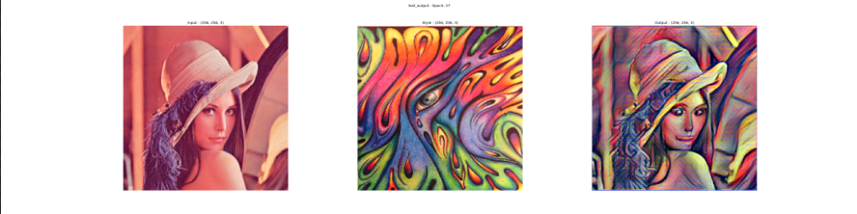

# Multimodal Style Transfer via Graph Cuts Implementation in TF 2.0.0a

Paper implementation of [Multimodal Style Transfer via Graph Cuts](https://arxiv.org/abs/1904.04443)


## Results 

Open `Test.ipynb` to run your own tests.

`alpha=1`





## Training

To start local training (after building the image datapath structure), simply run:

```
cd trainer
python train.py
```

or see below

### Data Structure

To load the data we assume the following structure, both locally and remotely:
```
trainer
-- data
  -- content
    -- images_*.png
  -- style
    -- images_*.png
```

### Local
First, create the following project structure locally.
```
git clone repo
cd repo/trainer/
mkdir data
cd data/
mkdir content
mkdir style
```

Then simply run the shell script to start training

```
sh train.sh local
```

### Remote - GCP
Edit `train.sh` to specify your `datapath=gs://path_to_data_dir/` variable. 
```
sh train.sh remote
```

## Transfer Learning
If you wish to use pretrained decoder weights, specify the path to them using `weights` parameter in the `train.sh` file.


